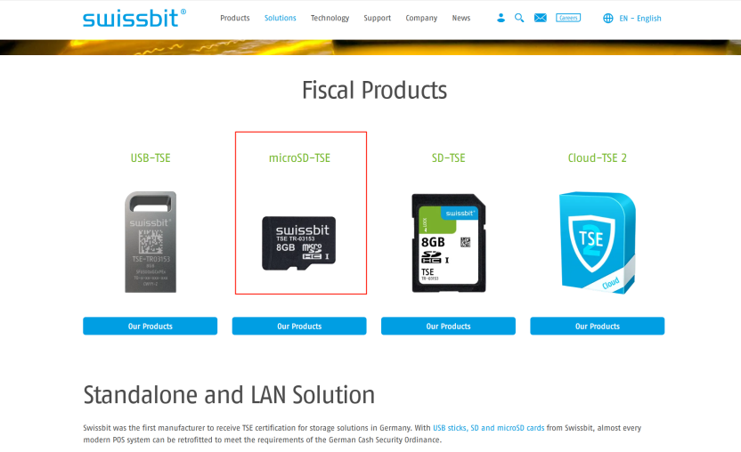

## FQA

## 2025.6.27.2
Title: "No Write Access to SD TSE on Android 13 (PrimeOne-150, RK3568) – Compatibility Issue?" 
Q: Hi, we have a technical question about the following item:  Touch Display Tablet 15 inch PoE with 8GB/64GB, RK3568 Android 13, PrimeOne-150. After talking to one of your employees, we bought the model above to use as a cash register system. However, according to the POS software operator, we now have the following problem: The SD card was found in the operating system (under “/storage/5AFD-8706”), but it is not writable (“no write access”). Below is the official information from SwissBit.## Android### USB TSEsThe SDK has been successfully tested on Android version 5-13.All Android versions are supported, including Android 11.Please note that this is only true if the Android Device makes the TSE available as a proper USB device. Some Android devices do not allow accessing the TSE as a real USB device, but just recognize it as a regular mass storage device. In that case, support for USB TSEs is the same as for microSD and SD TSEs, i.e. Android 11 will NOT work.### microSD and SD TSEsThe SDK has been successfully tested on Android version 5-10, and Android 12-13.Android 11 is not supported, since Google removed functionality that is required to communicate with the TSE. We worked with Google to bring this functionality back, which they did in Android 12. Starting with Android 12, the SDK works again. However, please note that there are still some devices that did not include the fixes made by Google and thus the SDK does not work for them. This is most likely the case if your device originally shipped with Android version 11 or below and was then updated to Android 12 (or later). Please contact your device manufacturer for further information. The relevant patch that needs to be included by the device manufacturer can be found on the [Android website](https://cs.android.com/android/_/android/platform/packages/providers/MediaProvider/+/cd7b998d7d59701bd823cbeb35cfc06f7b66332a). Devices that come with Android 13 (or later) from the factory should work, but this cannot be guaranteed, as device manufacturers are free to include(or not include) certain changes and often do so. Please test the example application on your device to ensure it works correctly. 

A：It should be a special card that was used. Writing with a regular TF card is not a problem.

https://www.swissbit.com

---

## 2025.6.27.1
Title: "New Firmware Lacks HDMI Resolution Settings on DS5 RK3588 – Request to Re-enable" 
Q：Please can you do me a new Firmware where it is possible to change HDMI Resolution again. Android TV has this settings, the new Firmware does not have. MinipcTable_RK3588_4D32_AP6275P_1000M_A12_HG0002_F1010_20240228_R4_de----   

This Firmware is for DS5 RK3588. We have made this settings for the old Firmware with Android TV but in new Firmware we forgot.

A：This is the table firmware. Only the box firmware can modify the resolution. For the DS5 Pro box, Android has always released BOX firmware
settings---->Device Preferences--->Display--->HDMI--->Resolution

## 2025.6.12
Title: "SIM Card Still Fails After Reboot in v2024123113 – PIN Loop or No Connection" 
Q：I just had a moment and installed the new version (v2024123113):
Basically the problem still exists, I still end up - with a SIM card with PIN - in a kind of "crash loop" (every 30s new request for PIN entry), or - with a card without PIN - in the previously observed status ("No connection" after, for example, an external call).
However, the problem with the rotation, which I had briefly added yesterday, has been resolved (with the exception of the multitasking/app switcher) and is now displayed correctly. 
A: Add a Sim Card in the player and call the number. After reboot the Sim does not work any longer.
