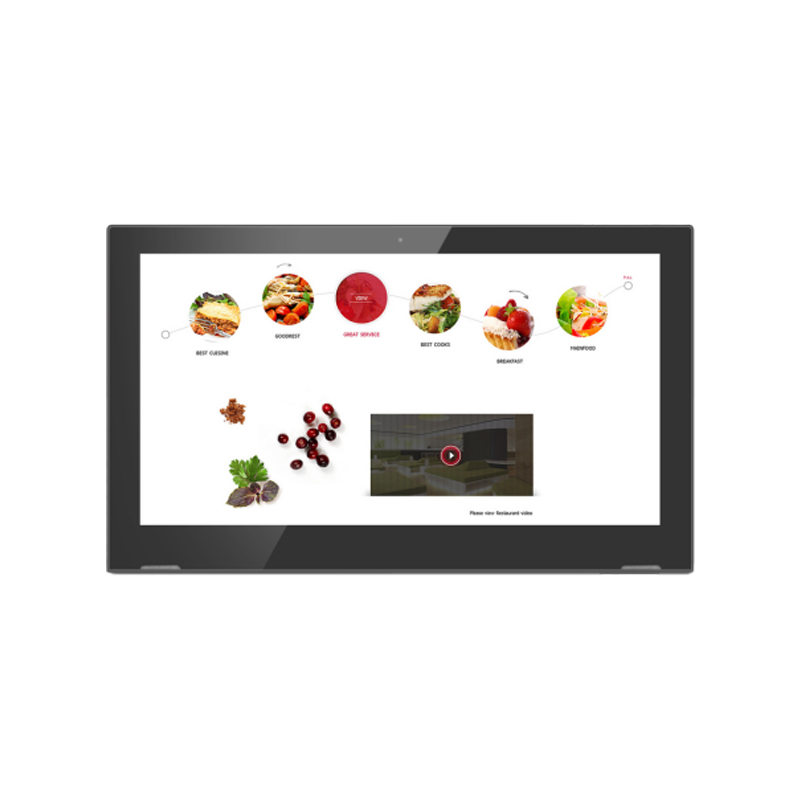
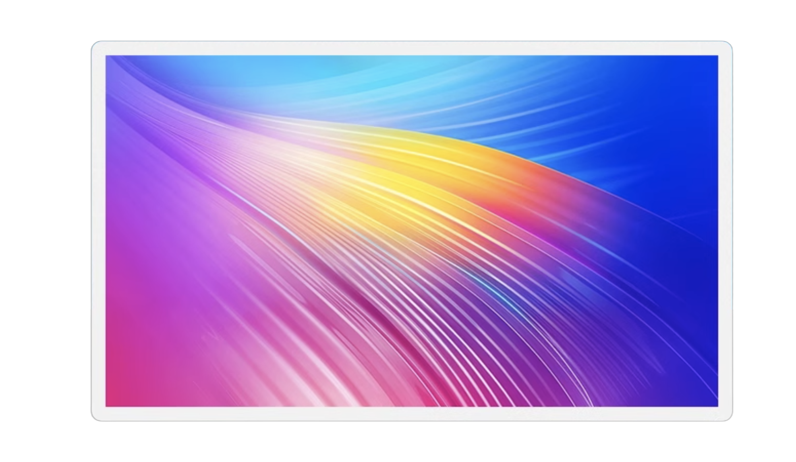
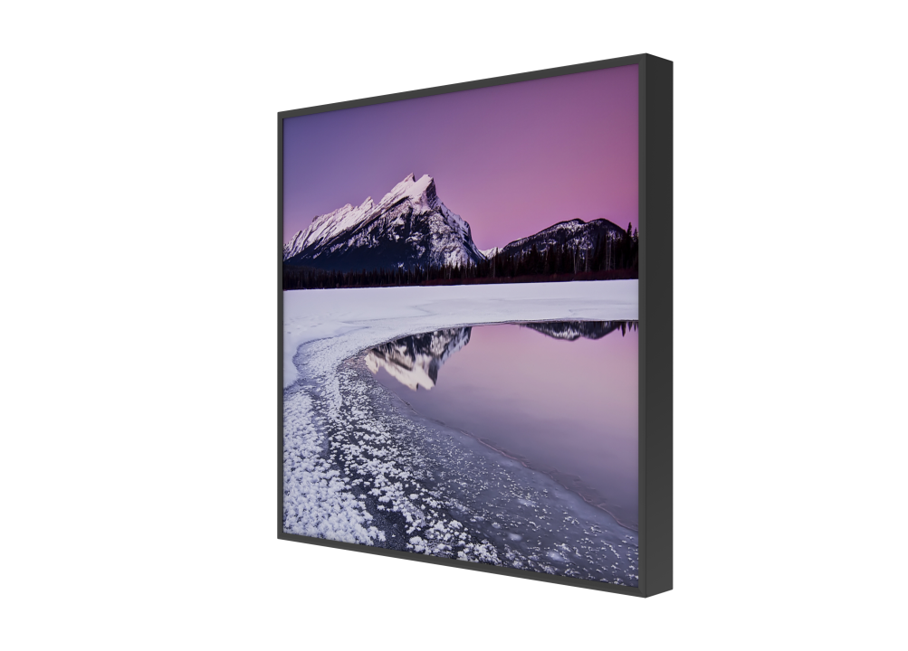
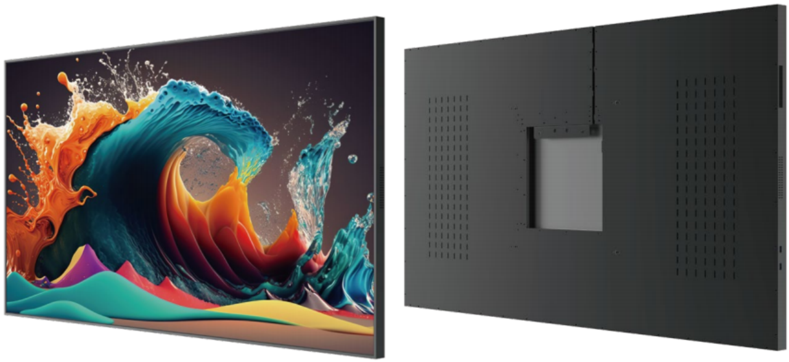

# Commerical Display

<table textalign="center">
<tr>
    <th><a href="">products</a></th>
    <th><a href="">Screen size</a></th>
    
</tr>
<tr>
    <td width="33%"></td>
    <td width="73%">
        touch screen (rk3566): 
        <a href="./zyx/specification/10.1.png">[10.1"]</a>&nbsp;&nbsp;&nbsp;
        <a href="./zyx/specification/11.6.png">[11.6"]</a>&nbsp;&nbsp;&nbsp;
         <a href="./zyx/specification/14.png">[14"]</a>&nbsp;&nbsp;&nbsp;
          <a href="./zyx/specification/15.6.png">[15.6"]</a>&nbsp;&nbsp;&nbsp;
           <a href="./zyx/specification/18.5.png">[18.5"]</a>&nbsp;&nbsp;&nbsp;
            <a href="./zyx/specification/21.5.png">[21.5"]</a>&nbsp;&nbsp;&nbsp;
            <a href="./zyx/specification/24.png">[24"]</a>&nbsp;&nbsp;&nbsp;
            <a href="./zyx/specification/27.png">[27"]</a>&nbsp;&nbsp;&nbsp;
            <a href="./zyx/specification/32.png">[32"]</a>&nbsp;&nbsp;&nbsp;
            <a href="./zyx/specification/43.png">[43"]</a>
             
             touch screen (rk3568): 
               <a href="./zyx/specification/10.1_3568.png">[11.6"]</a>&nbsp;&nbsp;&nbsp;
                
              touch screen (rk3588s): 
               <a href="./Tablets-for-Project/spectification/tfp-11.6.png">[11.6"]</a>&nbsp;&nbsp;&nbsp;
                
               touch screen (rk3576s): 
                <a href="./zyx/specification/10.1_3576s.png">[10.1" RK3576s]</a>&nbsp;
                <a href="./zyx/specification/14-3576s.png">[14" RK3576s]</a>
              &nbsp;&nbsp;&nbsp;
                
            windows touch screen: 
            <a href="./zyx/specification/18.5-win.png">[18.5" Intel Core i7]</a>&nbsp;&nbsp;&nbsp;
            <a href="./zyx/specification/18.5-win-i7-s.png">[18.5" Intel Core i7 T2]</a>&nbsp;&nbsp;&nbsp;
            <a href="./zyx/specification/15-i5.png">[15" Intel Core i5]</a>&nbsp;&nbsp;&nbsp;
            <a href="./zyx/specification/21.5_win_i7.png">[21.5" Intel Core i7]</a>&nbsp;&nbsp;&nbsp;
            <a href="./zyx/specification/21.5_win_i5.png">[21.5" Intel Core i5]</a>&nbsp;&nbsp;&nbsp;
             
            Non touch screen:
             
             <a href="./zyx/specification/non14.png">[14"]</a>&nbsp;&nbsp;&nbsp;
             <a href="./zyx/specification/non15.6.png">[15.6"]</a>
              
             MTK with GMS:
             
             <a href="./zyx/specification/15.6_mtk_8788.png">[15.6"]</a>
    </td>
   
</tr>

<tr>
    <td width="33%"></td>
    <td width="73%">
      <a href="./all-in-one/specification/55-all-in-one.png">[55"]</a>&nbsp;&nbsp;&nbsp;
        <a href="./all-in-one/specification/65-all-in-one.jpg">[65"]</a>&nbsp;&nbsp;&nbsp;
        <a href="./all-in-one/specification/75-all-in-one.jpg">[75"]</a>&nbsp;&nbsp;&nbsp;
         <a href="./all-in-one/specification/85-all-in-one.jpg">[85"]</a>&nbsp;&nbsp;&nbsp;
          <a href="./all-in-one/specification/98-all-in-one.jpg">[98"]</a>&nbsp;&nbsp;&nbsp;
    </td>
   
</tr>

<tr>
    <td width="33%"></td>
    <td width="73%">
        <a href="./Rounded-corner-plane/specification/15.6.png">[15.6"]</a>&nbsp;&nbsp;&nbsp;
        <a href="./Rounded-corner-plane/specification/21.5.png">[21.5"]</a>&nbsp;&nbsp;&nbsp;
         <a href="./Rounded-corner-plane/specification/23.8.png">[23.8"]</a>&nbsp;&nbsp;&nbsp;
    </td>
   
</tr>

<tr>
    <td width="33%">
    </td>
    <td width="73%">
        <a href="./ds/specification/22.png">[22"]</a>&nbsp;&nbsp;&nbsp;
         <a href="./ds/specification/33.png">[33"]</a>&nbsp;&nbsp;&nbsp;
    </td>
   
</tr>

<tr>
    <td width="33%"></td>
    <td width="73%">
        <a href="./ds/specification/32.png">[32"]</a>&nbsp;&nbsp;&nbsp;
    </td>
   
</tr>

</table>

# Contacts

- Website: www.we-signage.com
- https://we-signage.en.made-in-china.com/
- E-mail: dennis@we-signage.com
- Wechat: + 86 13349909990
- MP/Whatsapp:+86 17388781631
