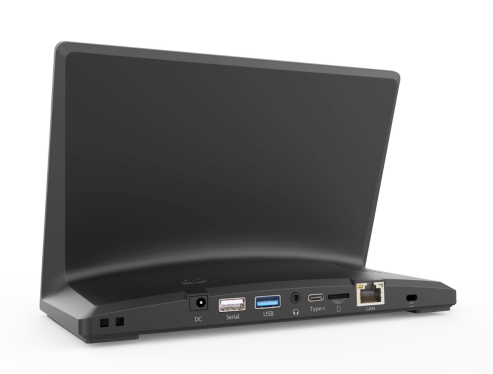
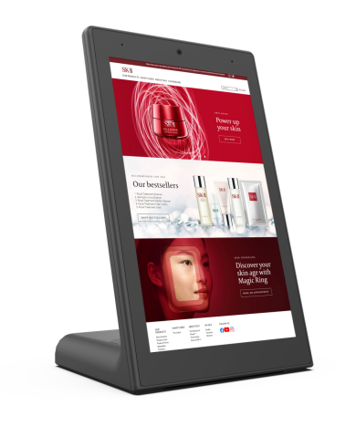
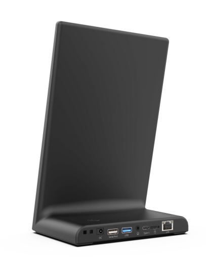
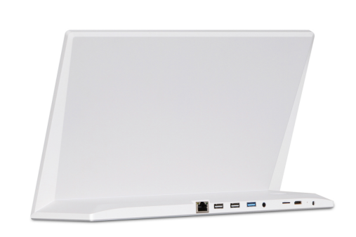
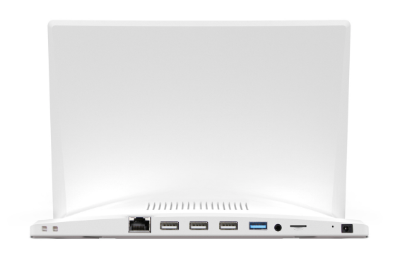
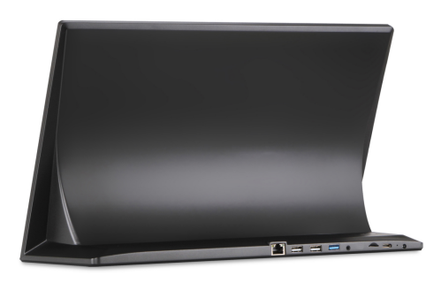

# L type AIO Display

<table textalign="center">
<tr>
    <th><a href="">products</a></th>
    <th><a href="">Screen size</a></th>
    
</tr>

<tr>
    <td ></td>
    <td width="40%">
        <a href="./specification/8-H-3566.jpg">[8"-H-RK3566]</a>&nbsp;&nbsp;&nbsp;
        <a href="./specification/8-H-3568.jpg">[8"-H-RK3568]</a>&nbsp;&nbsp;&nbsp;
    </td>
</tr>

<tr>
    <td ></td>
    <td>
        <a href="./specification/8-V-3566.jpg">[8"-V-RK3566]</a>&nbsp;&nbsp;&nbsp;
        <a href="./specification/8-V-3568.jpg">[8"-V-RK3568]</a>&nbsp;&nbsp;&nbsp;
    </td>
</tr>

<tr>
    <td ></td>
    <td>
        <a href="./specification/10.1-H-3566-T1.png">[10.1"-H-RK3566-T1]</a>&nbsp;&nbsp;&nbsp;
        <a href="./specification/10.1-H-3568-T1.png">[10.1"-H-RK3568-T1]</a>&nbsp;&nbsp;&nbsp;
         <a href="./specification/10.1-H-3566-T2.jpg">[10.1"-H-RK3566-T2]</a>&nbsp;&nbsp;&nbsp;
        <a href="./specification/10.1-H-3568-T2.jpg">[10.1"-H-RK3568-T2]</a>&nbsp;&nbsp;&nbsp;
    </td>
</tr>

<tr>
    <td ></td>
    <td>
        <a href="./specification/10.1-V-3566.jpg">[10.1"-V-RK3566]</a>&nbsp;&nbsp;&nbsp;
        <a href="./specification/10.1-V-3568.jpg">[10.1"-V-RK3568]</a>&nbsp;&nbsp;&nbsp;
    </td>
</tr>

<tr>
    <td ></td>
    <td>
        <a href="./specification/13.3-3566.jpg">[13.3"-RK3566]</a>&nbsp;&nbsp;&nbsp;
        <a href="./specification/13.3-3568.jpg">[13.3"-RK3568]</a>&nbsp;&nbsp;&nbsp;
    </td>
</tr>

<tr>
    <td ></td>
    <td>
        <a href="./specification/14-3566.jpg">[14"-RK3566]</a>&nbsp;&nbsp;&nbsp;
        <a href="./specification/14-3568.jpg">[14"-RK3568]</a>&nbsp;&nbsp;&nbsp;
    </td>
</tr>

<tr>
    <td ></td>
    <td>
        <a href="./specification/17.6-3566.jpg">[17.6"-RK3566]</a>&nbsp;&nbsp;&nbsp;
        <a href="./specification/17.6-3568.jpg">[17.6"-RK3568]</a>&nbsp;&nbsp;&nbsp;
    </td>
</tr>

</table>

# Contacts

- Website: www.we-signage.com
- https://we-signage.en.made-in-china.com/
- E-mail: dennis@we-signage.com
- MP/Whatsapp/Wechat: + 86 13349909990
- Skype: solled686
