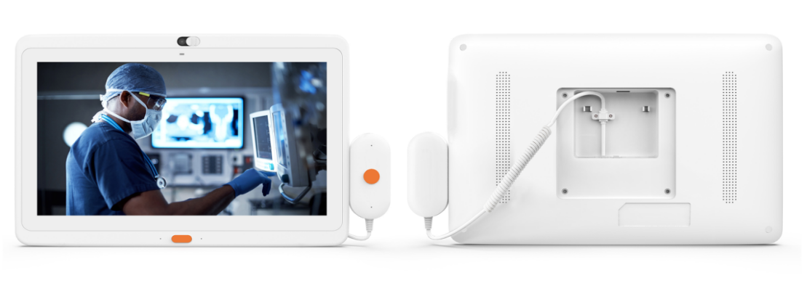

# Medical Health Display

<table textalign="center">
<tr>
    <th><a href="">products</a></th>
    <th><a href="">Screen size</a></th>
    
</tr>
<tr>
    <td ></td>
    <td >
        <a href="./specification/10.1.png">[10.1]</a>
    </td>
</tr>

<tr>
    <td ></td>
    <td >
        <a href="./specification/13.3.png">[13.3]</a>
    </td>
</tr>

<tr>
    <td ></td>
    <td >
        <a href="./specification/15.6.png">[15.6]</a>
    </td>
</tr>
</table>

# Contacts

- Website: www.we-signage.com
- https://we-signage.en.made-in-china.com/
- E-mail: dennis@we-signage.com
- Wechat: + 86 13349909990
- Linkedin: linkedin.com/in/wesignage
- MP/Whatsapp:+86 17388781631
- Youtube:<a href="https://www.youtube.com/@digitalsignagehyy9377">https://www.youtube.com/@digitalsignagehyy9377</a>