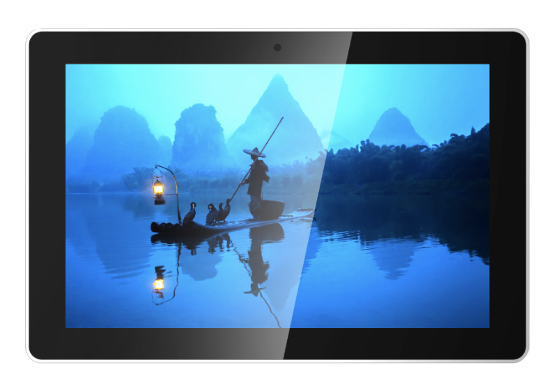

# Raspberry Pi Display

<table textalign="center">
<tr>
    <th><a href="./specification/raspberrypi-7-inch.jpg">7 inch</a></th>
    <th><a href="./specification/raspberrypi-10-inch.jpg">10 inch</a></th>
    <th><a href="./specification/15-CM4/README.md">15 inch CM4</a></th>
</tr>
<tr>
    <td width="33.33%"></td>
    <td width="33.33%"></td>
     <td width="33.33%"></td>
</tr>
</table>

# Contacts

- Website: www.we-signage.com
- https://we-signage.en.made-in-china.com/
- E-mail: dennis@we-signage.com
- Wechat: + 86 13349909990
- Linkedin: linkedin.com/in/wesignage
- MP/Whatsapp:+86 17388781631
- Youtube:<a href="https://www.youtube.com/@digitalsignagehyy9377">https://www.youtube.com/@digitalsignagehyy9377</a>