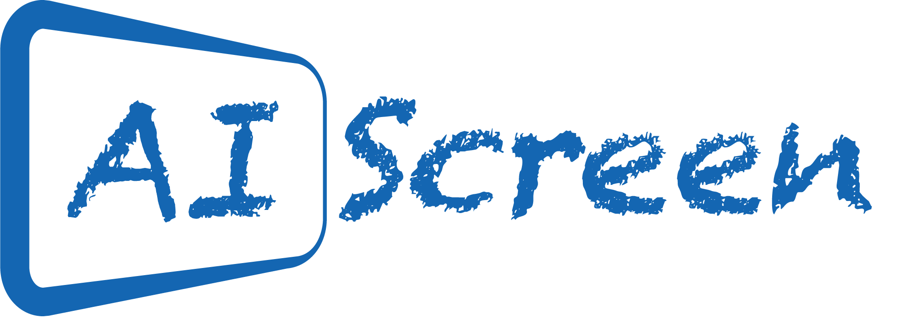
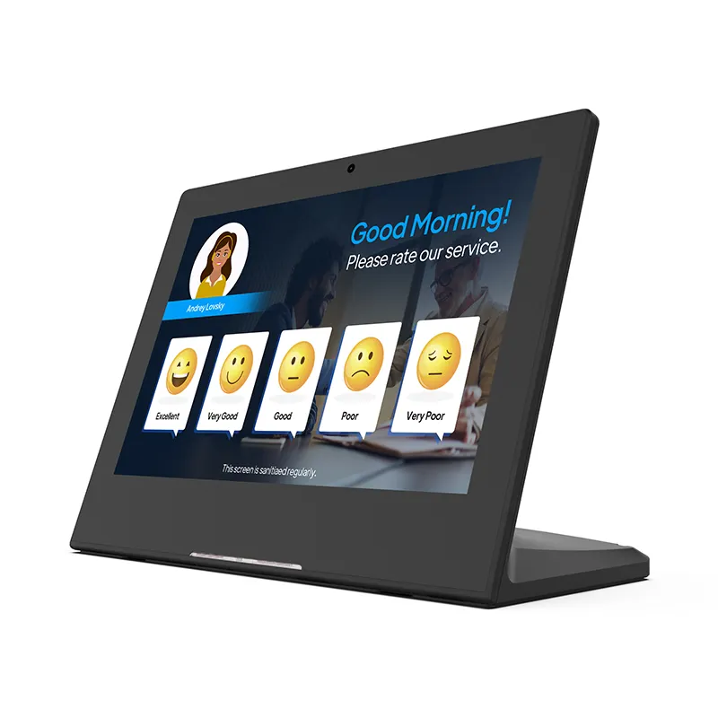
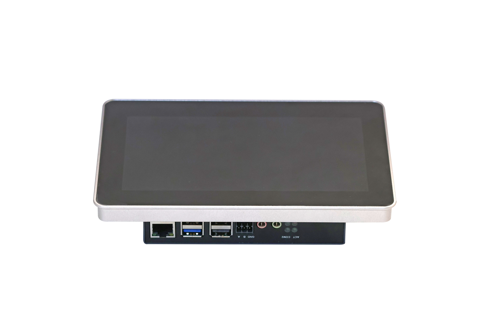
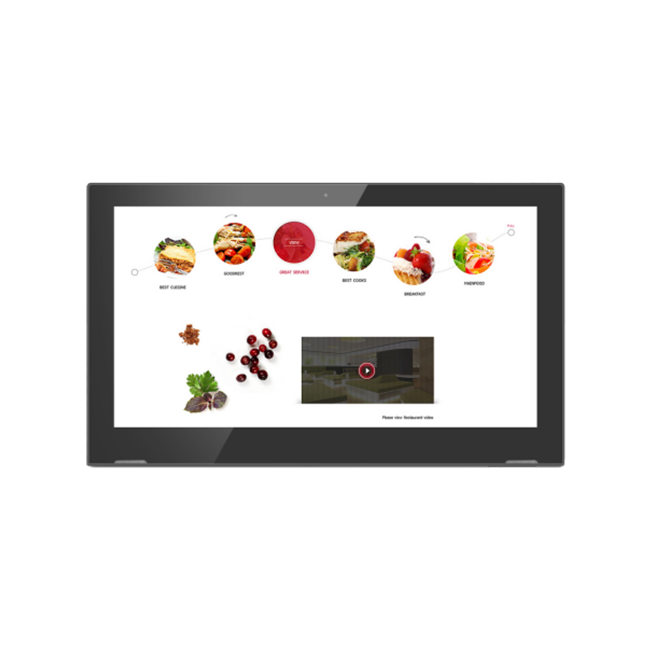
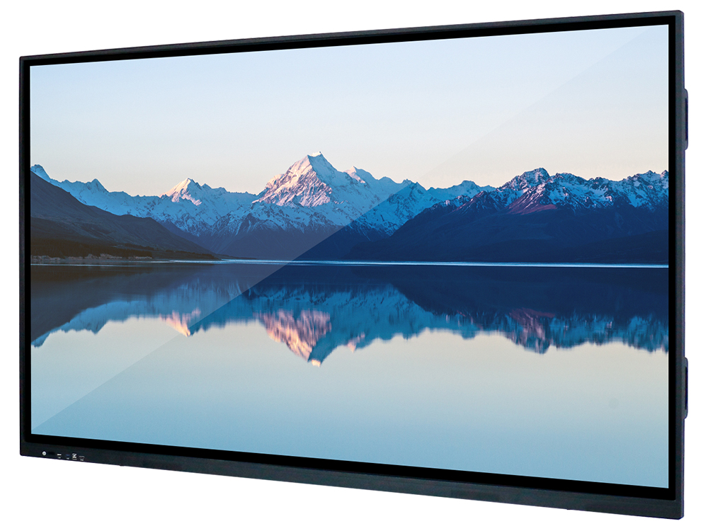
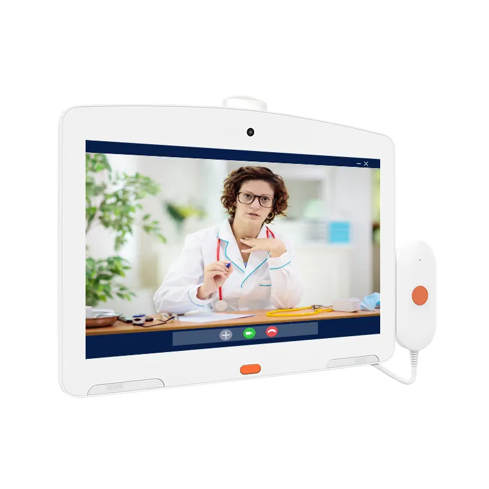
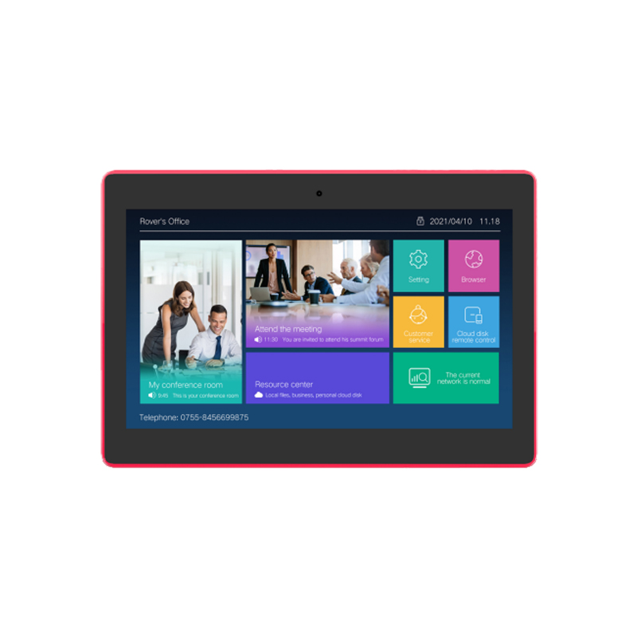
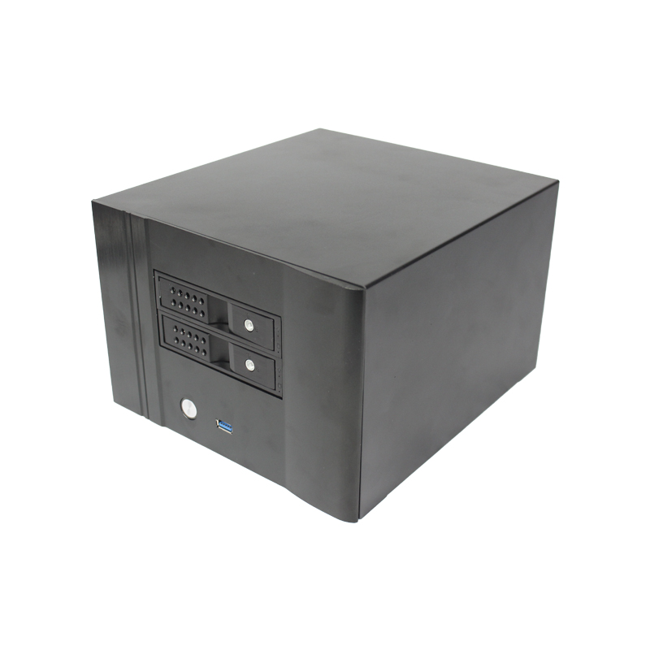
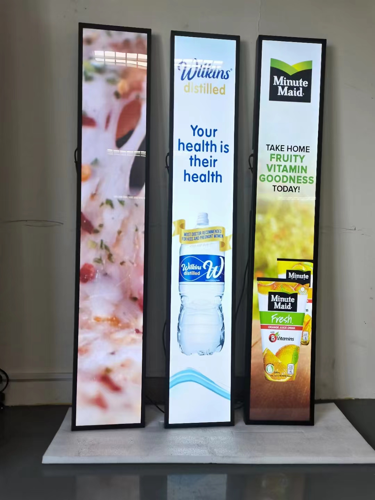
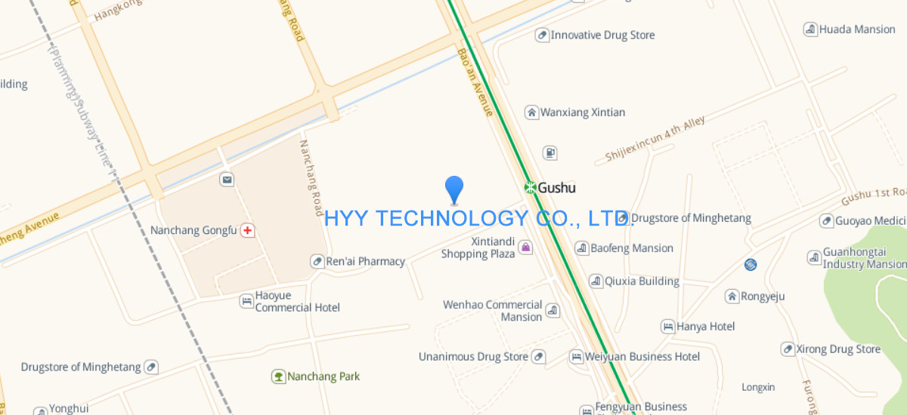

  

 

# AI-Powered Human-Computer Interaction

## Introduction
Welcome to the future of intelligent interaction with our cutting-edge Smart Screen designed by [HYY ↗](https://www.we-signage.com), featuring state-of-the-art AI-powered human-computer interaction capabilities. Designed to seamlessly integrate into your daily life, these devices leverages advanced artificial intelligence to provide an intuitive, responsive, and personalized user experience.
> This repository contains a curated list of useful resources for AI Screens products from [HYY ↗](https://www.we-signage.com).

## Contents

<table textalign="center">
  <tr>
    <th>L type AIO Display</th>
    <th>Raspberry Pi Display</th>
    <th><a  href="https://github.com/industrialtablet/AI-Screen/tree/main/Documents/Products/all-in-one" style="text-decoration: none;">Commerical Display</a></th>
  </tr>
  <tr>
  <tr>
    <td width="33.33%"></td>
     <td width="33.33%"></td>
      <td width="33.33%"></td>
  </tr>
  <!-- <tr>
    <td></td>
    <td><a href="https://github.com/industrialtablet/AI-Screen/tree/main/Documents/Products/all-in-one">Conference all-in-one machine</a></td>
    <td></td>
  </tr> -->
  <tr>
    <th>Medical Health Display</th>
    <th>Meeting room Display</th>
    <th><a href="https://github.com/industrialtablet/AI-Screen/tree/main/Documents/Products/box">NX witness Server</a></th>
  </tr>
   <tr>
    <td width="33.33%"></td>
     <td width="33.33%"></td>
      <td width="33.33%"></td>
  </tr>
  <!-- <tr>
    <td>Bar Screen</td>
    <td><a href="https://github.com/industrialtablet/AI-Screen/tree/main/Documents/Products/bar-screen">Bar Screen</a></td>
    <td></td>
  </tr> -->
  
</table>

<!-- - [AI-Powered Human-Computer Interaction](#ai-powered-human-computer-interaction)
  - [Introduction](#introduction)
  - [Contents](#contents)
  - [Meet the AI Screen Team](#meet-the-ai-screen-team)
  - [AI Screen Projects](#ai-screen-projects)
  - [Contacts](#contacts) -->

### Meet the AI Screen Team
<table>
  <tr>
    <td>
      
      
Dennis

    </td>
    <td>
      
      
Arlen

    </td>
    <td>
      
      
Yuanbao

    </td>
    <td>
      
      
Jen

    </td>
    <td>
      
      
Lillian

    </td>
  </tr>
</table>

## Contacts

- Website: www.we-signage.com
- https://we-signage.en.made-in-china.com/
- E-mail: dennis@we-signage.com
- MP/Whatsapp/Wechat: + 86 13349909990
- Skype: solled686

  

