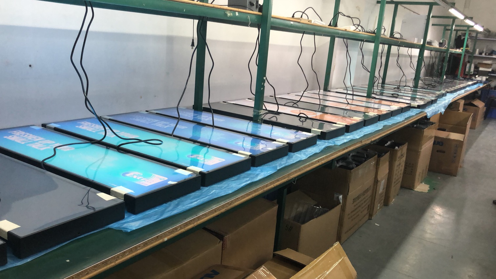
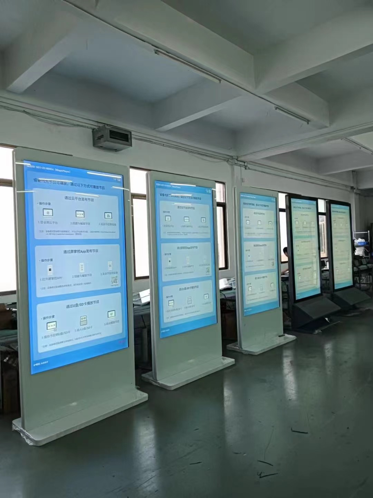

  

   

 

# AI-Powered Human-Computer Interaction

## Introduction
Experience seamless digital solutions with [HYY](https://www.we-signage.com), always a learner in the Digital Signage industry, specializing in Android, Windows, and Linux systems. We provide a versatile range of devices from mini 7-inch machines to expansive 65-inch screens, focusing on compact models and Mini PC boxes.

Our technology finds applications across various sectors including schools, hotels, restaurants, shopping malls, banks, and charging stations, among others. Powered by premium chipsets - RK3566, RK3568, RK3588 - our products are GMS certified, CE certified, and come with battery certification.

Proud of our decade-long experience in smart signage and human-machine interaction, our technically proficient team is committed to providing enhanced industry-specific solutions. We strive to connect with like-minded professionals, aiming to deliver immense value in our field of expertise.

## Contents

<table textalign="center">
  <tr>
    <th><a href="./Documents/Products/L-type-AIO-Display/">L type AIO Display</a></th>
    <th><a href="./Documents/Products/raspberry-pi/">Raspberry Pi Display</a></th>
    <th><a  href="./Documents/Products/Commercial-Display/" style="text-decoration: none;">Commercial Display</a></th>
  </tr>
  <tr>
    <td width="33.33%"></td>
     <td width="33.33%"></td>
      <td width="33.33%"></td>
  </tr>
  <tr>
    <th><a href="./Documents/Products/Medical-Health-Display/">Medical Health Display</a></th>
    <th><a href="./Documents/Products/Meeting-room-Display/">Meeting room Display</a></th>
    <th><a href="./Documents/Products/box/">AI Box</a></th>
  </tr>
   <tr>
    <td width="33.33%"></td>
     <td width="33.33%"></td>
      <td width="33.33%"></td>
  </tr>
  
</table>

### Product Delivery Photos
<table>
  <tr>
    <td>
      
    </td>
    <td>
      
    </td>
    <td>
      
    </td>
  </tr>
  <tr>
    <td>
      
    </td>
    <td>
      
    </td>
    <td>
      
    </td>
  </tr>
  <tr>
    <td>
      
    </td>
    <td>
      
    </td>
    <td>
      
    </td>
  </tr>
  <tr>
    <td>
      
    </td>
    <td>
      
    </td>
    <td>
      
    </td>
  </tr>
</table>

### Meet the AI Screen Engineer Team (Andriod/Linux/Windows)
<table>
  <tr>
    <td>
      
      
Dennis(CEO)

    </td>
    <td>
      
      
Arlen(CMO)

    </td>
    <td>
      
      
Zhang(CFO)

    </td>
    <td>
      
      
Owen(CTO)

    </td>
    <td>
      
      
Kevin(CTO)

    </td>
  </tr>
</table>

## Wiki
- [BootLogo Replacement by yourself](https://github.com/industrialtablet/AI-Screen/wiki/BootLogo-Replacement-by-yourself)

## Development
- [HYY RK3566 Device Android FrameWork API Interface Development Library](https://github.com/hejiangyan/HYY_rk3566_api)

## Contacts

- Website: www.we-signage.com
- https://we-signage.en.made-in-china.com/
- E-mail: dennis@we-signage.com
- MP/Whatsapp/Wechat: + 86 13349909990
- Skype: solled686
- Youtube:<a href="https://www.youtube.com/@Arlen-show">https://www.youtube.com/@Arlen-show</a>

  

